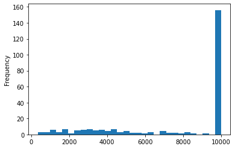
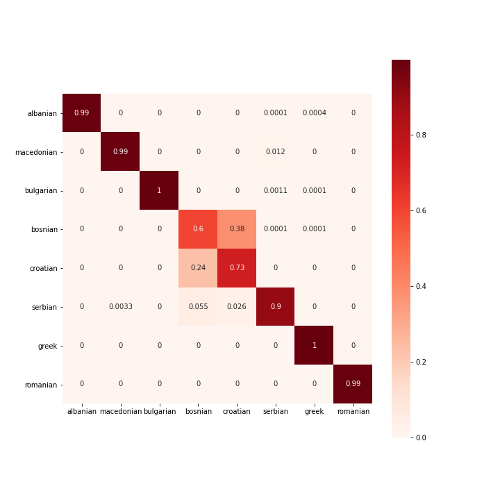
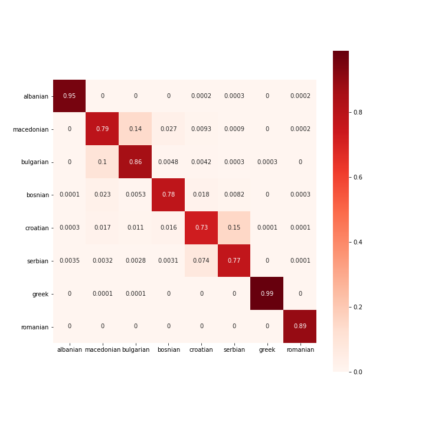

# 1. Introduction

Language identification is the problem of identifying the language of some text sample (or audio, or other medium). For a couple years, I have wanted to build a language identification system that supports more languages than Google Translate’s 109. I realized that this tool could be useful for linguistic analysis too. It is a well-known fact in machine learning that classifiers, like humans, will tend to confuse more similar things over less similar things. As a result, it can be expected that a language identification classifier will confuse Spanish and Portuguese more often than Spanish and Thai.

I used these ideas as the inspiration for my project, which has two main parts. First, I train a language identification classifier on as many languages as I can. Second, I analyze the mistakes made by the classifier to determine which languages appear to the classifier as most “similar”. I was interested to explore the true meaning of the word “similar”, because two languages can be genetically/ancestrally related, geographically close to one another, or culturally similar in a way that encourages many loanwords and a shared writing system. What type of “similar” causes the classifier to confuse languages more? Ultimately, I found geographical closeness to be the most important.

In section 2, I provide details on the dataset. In section 3, I walk through the language identification steps. Then, in section 4, I provide some analysis of the results from section 3.

# 2. Dataset

I gathered a dataset of Wikipedia article texts that includes 248 languages. The entire process is described in a reader-friendly way in [1-data-explanation.ipynb](https://nbviewer.jupyter.org/github/Data-Science-for-Linguists-2021/languageID-relatedconfusion/blob/main/1-data-explanation.ipynb). Besides removing HTML and formatting information, the text underwent only light cleaning to remove punctuation and special characters. Ultimately, I used two different versions of the dataset.

The first version is the [non-anonymized dataset](https://nbviewer.jupyter.org/github/Data-Science-for-Linguists-2021/languageID-relatedconfusion/blob/main/1-data-explanation.ipynb#The-chunked-subdirectory), which consists of just one file per language. Each line in each file is 500 characters long and is referred to as one “chunk”. The purpose for the chunks is that they are bite-sized input for the machine learning. I take the full cleaned article texts and split it into these chunks. To prevent big Wikipedias like English from overshadowing small Wikipedias like Old Church Slavonic in their proportions of the dataset, I limited the maximum number of chunks that a language could have to 10,000. Most languages have this full number of chunks, but a non-negligible number do not:

The minimum number of chunks for any language is 343 (for Lakku), while the average number of chunks is 7,719 and median is 10,000. The Chunked dataset is only 1.4GB, so I put these files in the [data_chunked](https://github.com/Data-Science-for-Linguists-2021/languageID-relatedconfusion/tree/main/data_chunked) directory for others to use (but please, if anyone reading this thinks they can use the full article texts, do not hesitate to contact! They were so much work to gather that I would be happy for them to be useful to anybody).

The second version is the anonymized dataset. I wanted to see how the machine learning would fare if it could not classify languages simply using the writing system, so I designed a language-agnostic writing system anonymization algorithm. For some language, I read in all the language’s chunks and compute how many occurrences there are of each character in the chunks. The most common character is assigned index 1, the second most is assigned index 2 and so on. The space character is always assigned index 0, so it stays the same across languages. Then, each character is replaced with its respective number. This way, if the classifier “sees” a 56, then it only “knows” that this is the 56th most common character in this language, not whether this character is Cyrillic, Hangul or any other writing system. The anonymization process is shown in [2-dataAnonAndPrep.ipynb](https://github.com/Data-Science-for-Linguists-2021/languageID-relatedconfusion/blob/main/2-dataAnonAndPrep.ipynb).

# 3. Machine Learning

As mentioned earlier, the [machine learning component](https://github.com/Data-Science-for-Linguists-2021/languageID-relatedconfusion/blob/main/3-naivebayes.ipynb) has two steps: language identification and relatedness clustering. Both steps were performed once for the non-anonymized dataset and once for the anonymized dataset. Section 3.3 shows some [additional, manual analysis](https://github.com/Data-Science-for-Linguists-2021/languageID-relatedconfusion/blob/main/4-clusterfun.ipynb) of one "case study" group of similar languages (Balkan Sprachbund).

## 3.1 Language Identification

[Language identification]((https://github.com/Data-Science-for-Linguists-2021/languageID-relatedconfusion/blob/main/3-naivebayes.ipynb)) was performed using [Multinomial Naïve Bayes (NB)](https://scikit-learn.org/stable/modules/generated/sklearn.naive_bayes.MultinomialNB.html) for counts of character bigrams, as implemented by scikit-learn. NB was chosen because it performed well in other homework assignments in the class earlier in the semester, so I was curious how it would fare with language identification. Bigrams were chosen because they seemed a good compromise between unigrams, which contain less information, and higher n-grams such as trigrams, which are more computationally intensive and suffer issues of information density. Feature counts, as computed by [Count Vectorizer](https://scikit-learn.org/stable/modules/generated/sklearn.feature_extraction.text.CountVectorizer.html#sklearn.feature_extraction.text.CountVectorizer), were chosen over other methods such as [tf-idf](https://scikit-learn.org/stable/modules/generated/sklearn.feature_extraction.text.TfidfVectorizer.html) because the idf (inverse document frequency) component seemed a little strange for documents written in different languages.

For the non-anonymized dataset, the classifier achieved 90.5% accuracy in five-fold cross validation using all default hyperparameters. All cross validation used stratified sampling, so each language’s chunks are split evenly across the five folds. Surprisingly, the anonymized dataset achieved 99% accuracy. One of the unusual aspects of this project is that high accuracy is only the goal to a certain extent – too high an accuracy means that the classifier is not confusing languages very often, which gives too small a chance to analyze which languages are similar. I needed to use grid search to play with different values of Count Vectorizer maximum features to bring the accuracy down.

The “maximum features” hyperparameter limits how many different bigrams will be counted by the vectorizer and provided to the classifier. For example, a maximum features value of 10 will cause the vectorizer to find the 10 most common bigrams in the dataset. Then, for each chunk, the vectorizer only counts the number of occurrences of these 10 bigrams. The default value of maximum features is “None”, meaning the vectorizer counts the number of occurrences of each bigram that ever occurs at least once in the dataset. The accuracy of 90.5% for the non-anonymized classifier worked well for the next step of relatedness mapping, so I tried many maximum feature values between 10 and 2000 to look for a similar accuracy on the anonymized dataset. Values of 20 and 25 gave accuracies of 89.8% and 92.8% respectively.

## 3.2 Language relatedness mapping

The second goal of the project, relatedness mapping, relies on analyzing which languages were commonly confused by the classifier. To do so, the NB confusion matrix is input to [k-means clustering](https://scikit-learn.org/stable/modules/generated/sklearn.cluster.KMeans.html). The input to this clustering algorithm is n datapoints and the output is k groups, where each datapoint has been assigned to one group in such a way that groups are as similar as possible. In the NB confusion matrix, rows correspond to the true language and columns to the predicted language. So, the input to the clustering can be the rows of the confusion matrix, with the columns/predictions serving as the features of the datapoints. Datapoints with similar features, meaning true languages that were consistently predicted by the classifier to be the same languages, will be clustered together. In fact, [this is precisely what happened](https://github.com/Data-Science-for-Linguists-2021/languageID-relatedconfusion/blob/main/3-naivebayes.ipynb). Playing with the number of groups (k), the value k=150 seemed to provide the most informative clusters. Some examples for the non-anonymized data:

-	Swahili, Tsonga, Xhosa, Chewa, Kinyarwanda (Bantu)
-	French, Norman, Picard (Oïl)
-	Persian, Gilaki, Mazanderani (Western Iranian)
-	Central Bikol, Cebuano, Javanese, Pangasinan, Tagalog (Malayo-Polynesian), Tok Pisin (English creole)
-	Alemannic, Ripuarian, Pennsylvania German, Palatine German (High German)
-	Romanian (Balkan Romance), Silesian (West Slavic), Kotava, Lojban (constructed)

Many of these groupings make sense, but some help in drawing interesting conclusions. Much of Tok Pisin’s vocabulary is based on English, while its syntax is based on the languages it is geographically close to and that it ultimately clustered with. Despite Romanian being a Romance language, it clustered with a Slavic language that is located nearby. As such, these results indicate that geographical relatedness is more important to language similarity than genetic relatedness. Unfortunately, even with lower accuracy, clustering on the anonymized data never quite worked out. Languages’ predictions must still have been distinctive enough from one another that they were unable to cluster together in a meaningful away.

## 3.3 Further analysis

Another way to analyze the confusion matrix for relatedness is to take subsets of the matrix that only correspond to a certain group of languages, which is performed in [4-clusterfun.ipynb](https://github.com/Data-Science-for-Linguists-2021/languageID-relatedconfusion/blob/main/4-clusterfun.ipynb). For instance, the Balkan Sprachbund is a group of languages in the Balkans, some genetically related and others not, that have been influencing each others’ grammar and vocabulary for centuries due to their geographical proximity. Here is the subset of the non-anonymized NB matrix for only Albanian, Macedonian, Bulgarian, Bosnian, Croatian, Serbian, Greek and Romanian:

The rows are true languages and columns are predicted languages. A cell labeled 0.0001 means that exactly one chunk fell into that cell, and a cell labeled 0.38 means that 3800 chunks, or 38% of that language’s 10000 true chunks, fell into that cell.

It is readily apparent to anyone familiar with these languages that writing system is playing a large role here. Despite Bosnian, Croatian and Serbian generally being considered the same language, Serbian is seldom confused with the other two and vice versa because Serbian is frequently written in Cyrillic while Bosnian and Croatian are in Latin script. The other languages written in Cyrillic here are Macedonian and Bulgarian; Albanian and Romanian are in Latin while Greek has its own alphabet. However, there are some surprising results here. For instance, 33 Serbian chunks were confused with Macedonian, despite Macedonian being more mutually intelligible with and generally being considered more similar to Bulgarian. Macedonian and Bulgarian were never confused with each other. Romanian was never confused with any of the other Sprachbund languages and vice versa, despite Romanian being similar enough to cluster with the West Slavic language Silesian in the previous section. Other West Slavic languages include Polish, Czech and Slovak, while all Balkan Sprachbund Slavic languages are South Slavic. Here is the same plot for the anonymized dataset (max features of 25):

This seems much better, because Croatian and Serbian are now getting confused with each other more frequently because their writing systems have been hidden. Macedonian and Bulgarian get confused now, too (even though both are written in Cyrillic, each has special characters that the other does not, so perhaps the writing system anonymization overcame this as well).

See the [notebook](https://github.com/Data-Science-for-Linguists-2021/languageID-relatedconfusion/blob/main/4-clusterfun.ipynb) for a similar analysis of major Romance languages.

# 4. Conclusion

This project went well, in my opinion, since I never had to spend a lot of time on a false direction or unsolvable problem. There are things I would do differently now, but everything still worked. For that reason, what I walked through in this report is pretty much everything I did. The data gathering process was probably the most difficult. The networking setup was a little complicated and I would be staying up until 3-4am on the weekends to work on it since that was when the CRC had more resources availible (it was interactive since I need to enter the remote computer's password to start the connection, then make sure nothing went wrong). I had more experience with ML at the start of this project than networking or data wrangling, so I had an easier time in the later steps with finding solutions like doing clustering on a confusion matrix.

Overall, this project has been a lot of work, but I feel it paid off. For the first goal of language identification, I was able to reach over 99% accuracy using the anonymized dataset. For the second goal of relatedness mapping, the clustering indicates that geographical relatedness is more important than genetic relatedness. Further, manually inspecting subsets of the confusion matrix allow myriad takeaways to be formed regarding particular groupings of languages such as the Balkan Sprachbund.
